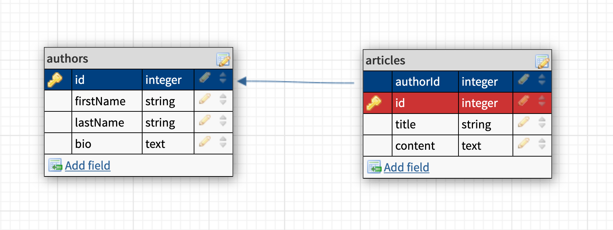
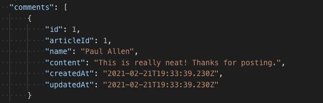

# Express BlogPulse

To practice 1:M associations, we'll be adding comment functionality to an existing blog application.

#### Backstory: BlogPulse

Congrats! You have been hired by BlogPulse, an up-and-coming blog marketed as a local version of [Buzzfeed](https://www.buzzfeed.com/). Through BlogPulse, anyone can sign up to become a contributor, and contributors can create articles relating to issues and events in the Puget Sound area. However, we need you to add comment functionality to this site.

## Getting Started (We do)

We'll be using an existing application that includes two models and several routes.

* Fork and clone this repository
* look in `package-lock.json` to see the packages thi project needs
  * Run `npm install` to install dependencies
* Setup your database (this app already has two existing models)
  * look in your config file to see the database name and edit if needed
  * Run `sequelize db:create` to create the database
  * Run `sequelize db:migrate` to run migrations
  * Run `sequelize db:seed:all` to populate the database with 2 authors and 2 articles
* use `nodemon` to start your application

#### Read the Code

After setup, **STOP**. You're using an existing application, so make sure to read the code and ensure what the application does. Here are the resource documents the last backend engineer has provided:

#### Routes

| Method | Path | Purpose |
| ------ | -------------- | -------------------------------- |
| GET | `/` | index that READS all articles and thier authors |
| GET | `/authors` | author index that READS all authors |
| POST | `/authors` | CREATES a new author, then redirects to the new author at `GET /authors/:id` |
| GET | `/authors/:id` | READS a specific author and their articles |
| POST | `/authors/:id/articles ` | CREATES a new article, then redirects back to the new article at `GET /articles/:id` |
| GET | `/articles/:id` | READS a specific article and the author |

[Here](https://www.getpostman.com/collections/dc8731aace792e95b8ef) is a link to the postman.app collection the last engineer was using to test the API routes.

#### Models
  
  * `author`
    * Attributes: `firstName`, `lastName`, `bio`
    * Associations: Has many articles
  * `article`
    * Attributes: `title`, `content`, `authorId`
    * Associations: Belongs to one author

#### Database ERD:



## User Stories

* As a user, I want to comment on an article in order to express my opinions.
* As a user, I want to view comments on an article in order to see my community's opinions about an article.

## Requirements 

### Part 1: Planning (We do)

Before you start slinging any code, you need to plan out how do develop theses new features.

* Create an **ERD** that reflects the database schema and plan out how to factor a `comments` table into it. 
  * It's recommended that you plan to name this table `comments` and the associated sequelize model `comment`. 
  * It will store three attributes: the name of the person creating the comment (as a string), the content of the comment (as text), and the article that the comment belongs to (as an integer)
* Create a spreadsheet/resource document of the routes you will need to implement and the controllers they will use. Follow **RESTful routing** best practices.
  * Think about what route you will need to add a comment. What controller does it belong in?
  * From a user's perspeciive consider when you should display an article's comments. Do you need a new route for this, or can you modify an existing one?
* Notice how `server.js` is sloppy and not using `express.Router()` to manage controllers. You will need to refactor this API into a scalable codebase before adding any new features. 
  *Plan out this controller refactor in your **RESTful routing** resource document as well.

### Part 2: Implement codebase refactors (You do)

Following the **RESTful routing** resource document, implement the controller refactor and stub out any new routes for testing.

#### *What does stubbing a route mean?*

Remember function stubbing from unit 1? Route stubbing is the same process, but with express routes.

<details>
  <summary>What does a route stub look like?</summary>

  an express route stub just needs to recieve a request on the desired path and repond with a test message:

  ```js
  app.get('/resources', (req, res) => {
    res.send('you hit the /resources endpoint!')
  })
  ```
</details>

<details>
  <summary>Help I'm stuck on making the new controllers!</summary>

  create your controllers folders and make js file for each controller you need with this controller boilerplate:

  ```js
  // instantiate the express router
  const router = require('express').Router()
  // require models
  const db = require('../models')

  // routes should be mounted on the router here

  // export the router so we can require in server.js
  module.exports = router
  ```

  don't forget to tell express to use the controller in server.js!

  ```js
  // tells express what the URL path is and where to look for the routes
  app.use('/resource', require('./controllers/resource.js'))
  ```
</details>

<details>
  <summary>My controllers still don't work!</summary>

  when refactoring a route into a controller don't forget to mount the route on the `router` and update the route's path!

  this:

  ```js
  app.get('/resources', (req, res) => {
    res.send('you hit the /resources endpoint!')
  })
  ```

  becomes this:

  ```js
  router.get('/', (req, res) => {
    res.send('you hit the /resources endpoint!')
  })
  ```

  Why though?

  Becasue this line of code in `server.js` tells express to look in the `./controllers/resource.js` file and put the URL path `/resources` in front of all of the routes it finds.

  ```js
  // tells express what the URL path is and where to look for the routes
  app.use('/resources', require('./controllers/resource.js'))
  ```
</details>

### Part 3: Create a Comment model

Following your **ERD** plans, create your sequelize model for comments.
  * after your model is created, don't forget to migrate!
  * once you have migrated the model, you can use the `psql` shell to check that everything has gone correctly.

Once your model has been created, **add the associations between comments the articles**. This will look similar to how authors and articles are related in the existing code in this app. Note the associate section in the models for both `article.js` and `author.js`.

Go ahead and associate your new comments model and the existing article model in a similar fashion. 

Remember: *This is a one to many relationship.* One article can have many comments, but each comment belongs to a single article.

<details>
  <summary>Help! I'm not sure how to associate the models!</summary>

  One article has many comments, and more than one association is totally fine!

  ```js
  // in article.js
  static associate(models) {
    // define association here
    models.article.belongsTo(models.author)
    models.article.hasMany(models.comment)
  }
  ```

  And a comment will belong to an article:

  ```js
  // in comment.js
  static associate(models) {
    // define association here
    models.comment.belongsTo(models.article)
  }
  ```
</details>

### Create a comment

**Testing time!** 

test the model's functionality. This can be done in a separate file. An example:

**dbTest.js**

```js
const db = require('./models')

async function dbTest() {
  const article = await db.article.findOne()
  const comment = await db.comment.create({
    name: 'Paul Allen',
    content: 'This is really neat! Thanks for posting.',
    articleId: article.id
  })
  console.log(comment)
}

dbTest()
```

Be sure to also test querying comments off of articles, which should verify that the association exists. Here's an example, once you've created a comment:

```js
const db = require('./models')

async function test() {
  const article = await db.article.findOne({
    where: { id: 1 },
    include: [db.comment]
  })
  // by using eager loading, the article model should have a comments key
  console.log(article.comments)
}
test()
```

#### Part 2: Integrate the model with the app

Now that the model has been created, you'll want to add the ability to create and view comments to the rest of the application. Here is an approach that can be taken:

* Add the ability to view comments on `GET /articles/:id`.
* Add the ability to make a comment on a specific article at `POST /articles/:id/comments`. Respond with a redirect to `/articles/:id`.

## Bonuses

* Add the ability to edit and delete articles
* Add the ability to edit and delete comments

what routes will you need to accomplish this? what controller should they go in?

## Example Comment Response

Here's an example screenshot of a comment.



---

## Licensing
1. All content is licensed under a CC-BY-NC-SA 4.0 license.
2. All software code is licensed under GNU GPLv3. For commercial use or alternative licensing, please contact legal@ga.co.
